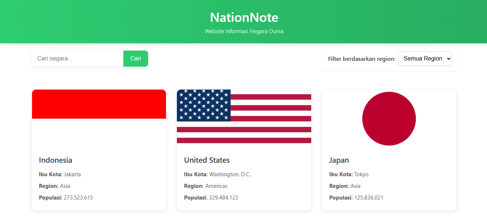
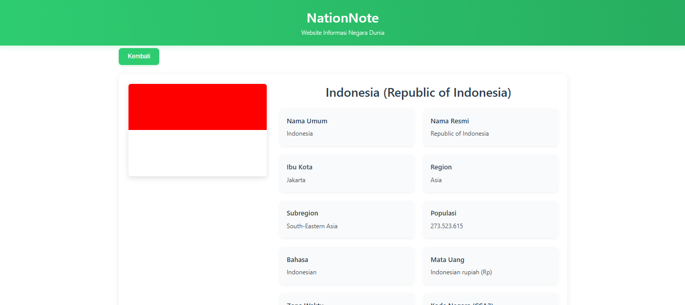

# NationNote
Website Informasi Negara Dunia

## Nama Website
NationNote
Website Informasi Negara Dunia

## Teknologi yang Digunakan
- React.js
- Vite
- JavaScript
- React Router
- REST Countries API
- CSS
- Git & GitHub

## Deskripsi dan Tujuan
NationNote adalah aplikasi web berbasis React (Vite) yang digunakan untuk menampilkan informasi lengkap negara-negara di dunia dengan memanfaatkan REST Countries API. Aplikasi ini menyediakan fitur daftar negara, pencarian, filter, serta halaman detail yang menampilkan seluruh atribut negara yang dipilih.

Tujuan aplikasi ini adalah:
- Menyajikan informasi negara secara lengkap dan terstruktur
- Melatih penggunaan React dalam pengambilan data dari Public API
- Mengimplementasikan routing, pencarian, dan tampilan responsif
- Memenuhi kebutuhan tugas mata kuliah Praktikum Pemrograman Web

## Anggota Kelompok 3
1. Hisyam Eka Pramudita - 2307016 (shineistu86)
2. Wida Rahayu - 2307028
3. Rendi Ramdani Sobarna - 2307013

## Fitur Aplikasi
- Fetch data dari API (REST Countries API)
- Menampilkan data (list/card)
- Halaman detail
- Pencarian atau filter
- Routing halaman
- Tampilan responsive

## Cara Instalasi dan Menjalankan Aplikasi
1. Clone repository ini
2. Masuk ke direktori proyek: `cd nationnote-app`
3. Install dependensi: `npm install`
4. Jalankan aplikasi: `npm run dev`
5. Buka browser dan akses: `http://localhost:5173`

## Screenshot

